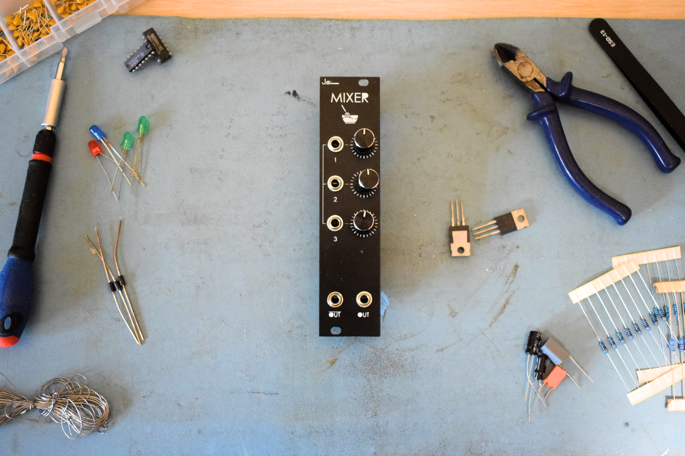

# Mixer
Simple Eurorack compatible 3 input - 2 output (one channel) mixer. 

## Features
- **EURORACK** compatible. 100KOhm input and 1KOhm output impedances. Compatible with eurorack sizes standard (128.5mm (3U) x 6HP).
- This is a simple OPAmp based adder that mixes 3 input signals, each with its own volume knob into 2 (inverse) outputs.

## Components

Full list of components needed are included in the mixer.csv file. 

- Potentiometers are Vertical Alpha 9mmm. 
- Jack sockets are PJ301M-12.
- Parallel feedback capacitors are not needed bur recommended.
